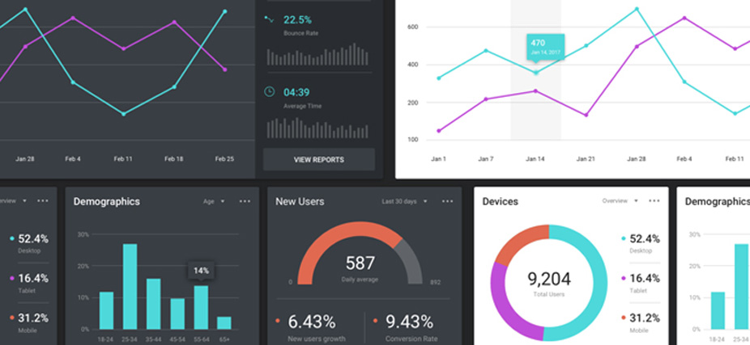

# Data visualization

#### -- Project Status: [Active]

## Objective
The idea behind this repository is to better understand the different type of visualization methods and when to use each one, taking into account the best practices in terms of design and interactivity.

### Featured notebooks
* [election_geo_analysis](election_geo_analysis.ipynb)
* [renewable_energy_map_switzerland](renewable_energy_map_switzerland.ipynb)
* [world_socio_economic_visualization](world_socio_economic_visualization.ipynb)

### Data and sources
* [Renewable power plants CH](https://data.open-power-system-data.org/renewable_power_plants/)
* [Cantons coordinates CH](https://data.opendatasoft.com/explore/dataset/georef-switzerland-kanton%40public/export/?disjunctive.kan_code&disjunctive.kan_name&sort=year&dataChart=eyJxdWVyaWVzIjpbeyJjb25maWciOnsiZGF0YXNldCI6Imdlb3JlZi1zd2l0emVybGFuZC1rYW50b25AcHVibGljIiwib3B0aW9ucyI6eyJkaXNqdW5jdGl2ZS5rYW5fY29kZSI6dHJ1ZSwiZGlzanVuY3RpdmUua2FuX25hbWUiOnRydWUsInNvcnQiOiJ5ZWFyIiwibG9jYXRpb24iOiI4LDQ2LjgyMjQyLDguMjI0MDMiLCJiYXNlbWFwIjoiamF3Zy5zdHJlZXRzIn19LCJjaGFydHMiOlt7ImFsaWduTW9udGgiOnRydWUsInR5cGUiOiJsaW5lIiwiZnVuYyI6IkNPVU5UIiwic2NpZW50aWZpY0Rpc3BsYXkiOnRydWUsImNvbG9yIjoiIzE0MkU3QiJ9XSwieEF4aXMiOiJ5ZWFyIiwibWF4cG9pbnRzIjoiIiwidGltZXNjYWxlIjoieWVhciIsInNvcnQiOiIifV0sImRpc3BsYXlMZWdlbmQiOnRydWUsImFsaWduTW9udGgiOnRydWV9&location=8,46.82242,8.22403&basemap=jawg.streets)
* [GitHub plotly datasets](https://github.com/plotly/datasets/blob/master/fips-unemp-16.csv)
* [Plotly data packages](https://plotly.com/python-api-reference/generated/plotly.express.data.html)
* [SNB money-market rate data](https://data.snb.ch/en/topics/ziredev/cube/zimoma)

### Technologies and packages
* Seaborn
* Plotly
* Plotlywidget
* Streamlit
* PyCharm
