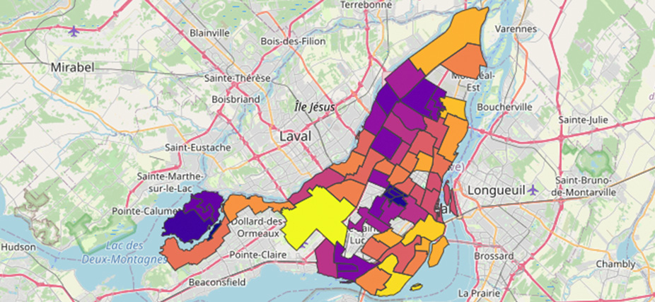

# Data visualization

#### -- Project Status: [Active]

## Objective
XXX.

### Notebooks
* [X](X.ipynb)
* [X](X.ipynb)
* [X](X.ipynb)

### Sources
* [X](X)
* [X](X)

### Technologies and packages
* X
